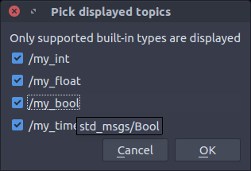
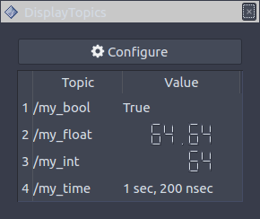

  Topics RViz plugin
===

This package contains a Qt RViz panel that allows users to display topics values dynamically.

Supported [built-in types](http://wiki.ros.org/msg#Fields) are:
- `bool`
- `duration`
- `float32`
- `float64`
- `int8`
- `int16`
- `int32`
- `int64`
- `string`
- `time`
- `uint8`
- `uint16`
- `uint32`
- `uint64`

:warning: Qt does not support displaying some types, these are casted:
- `int64` is casted to a `int32_t`
- `uint32` is casted to a `uint16_t`
- `uint64` is casted to a `uint16_t`

# Screenshots

# Project logo

